# School Management System - UML Documentation

## Overview

This document provides comprehensive UML diagrams for a School Management System, including class diagrams, activity diagrams, and sequence diagrams to illustrate the system's structure and behavior.

## 1. Class Diagrams

### 1.1 Core Entities Class Diagram

mermaid

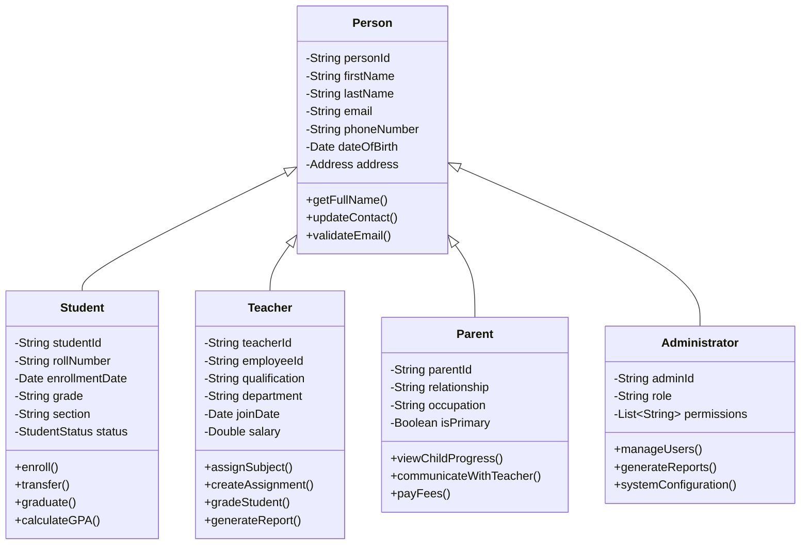

### 1.2 Academic Structure Class Diagram

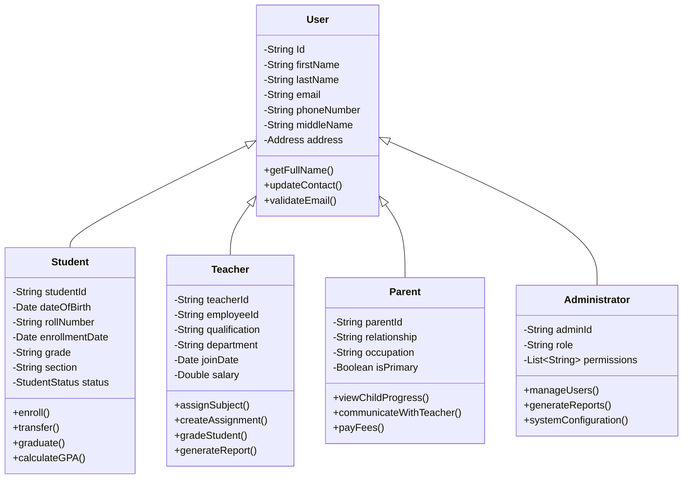

### 1.3 Assessment and Grading Class Diagram

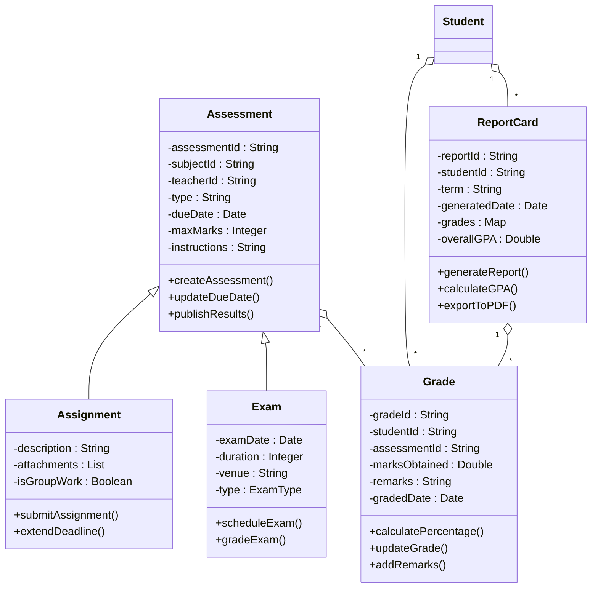

## 2. Activity Diagrams

### 2.1 Student Enrollment Process

mermaid

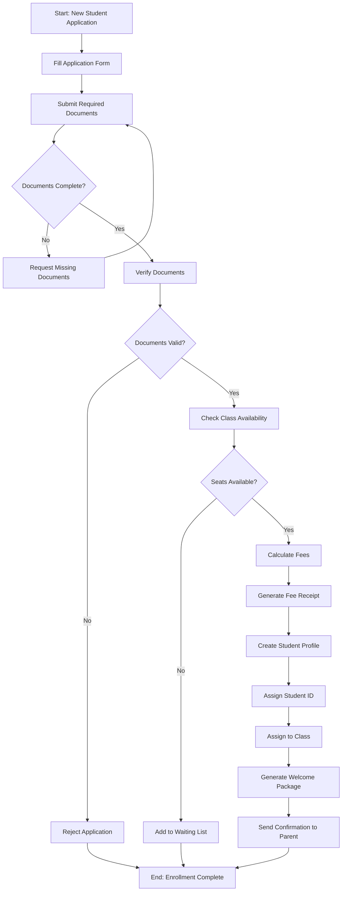

### 2.2 Grade Assignment Process

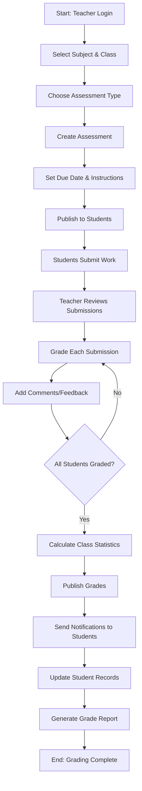

### 2.3 Fee Payment Process

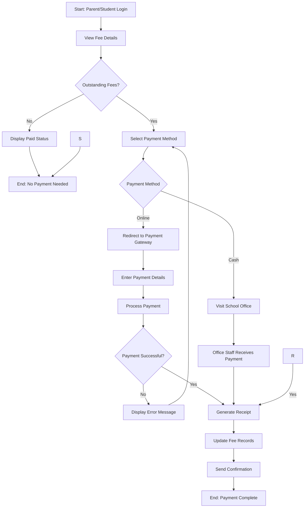

## 3. Sequence Diagrams

### 3.1 Student Login and Grade Viewing

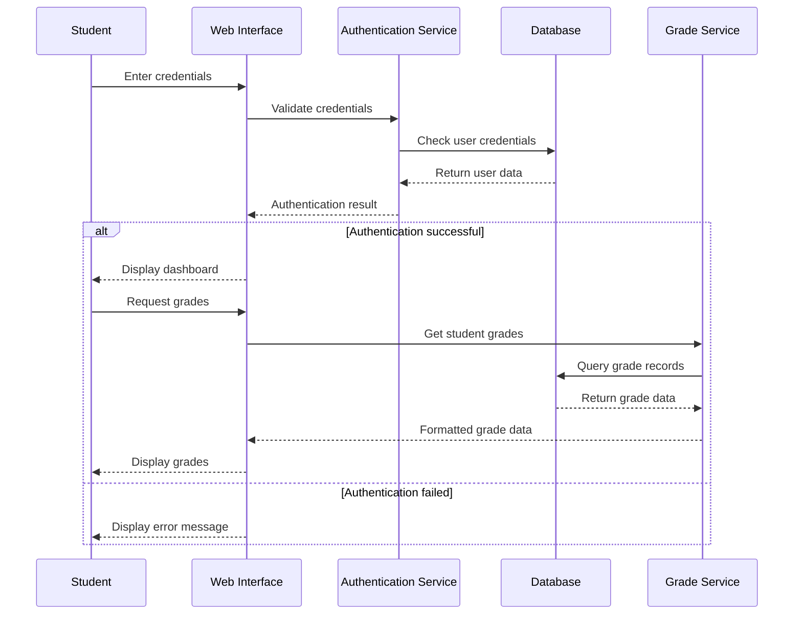

### 3.2 Teacher Creating and Grading Assignment

mermaid

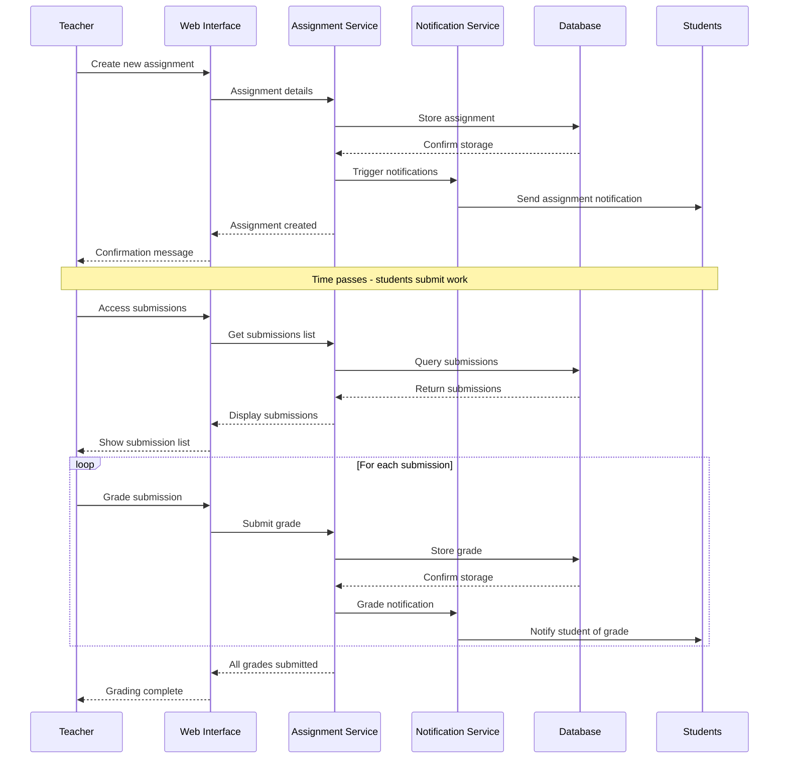

### 3.3 Parent Fee Payment Process

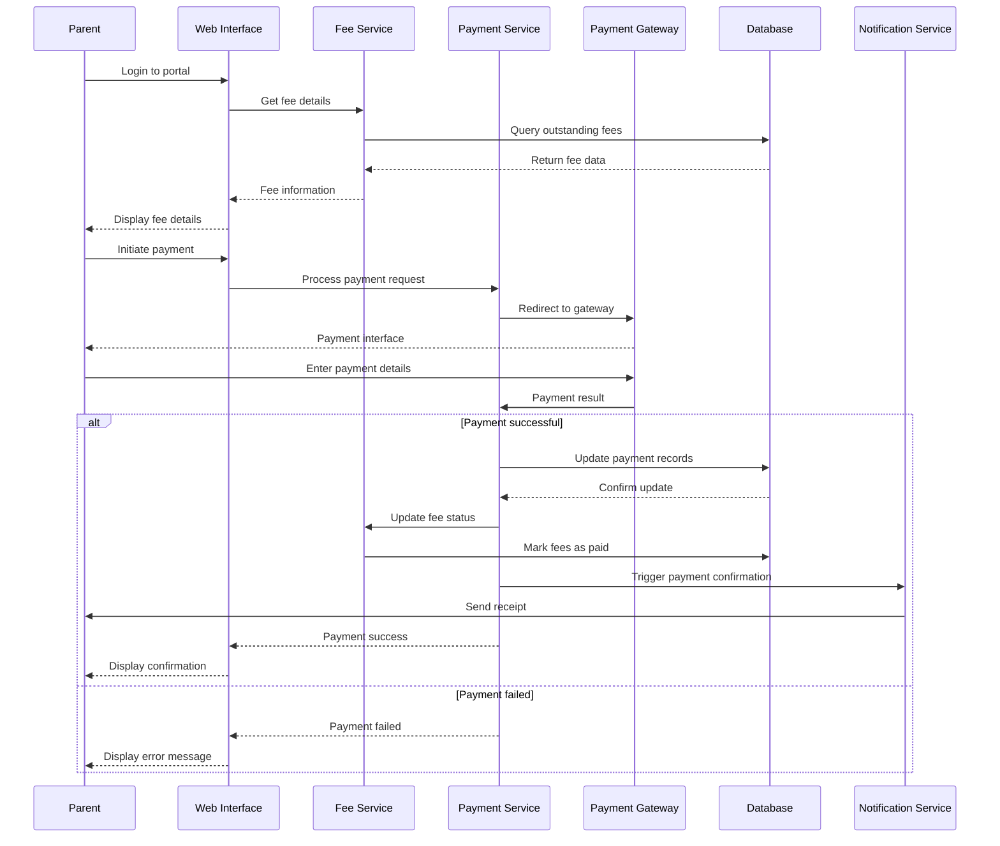

### 3.4 Administrator Generating Reports

mermaid

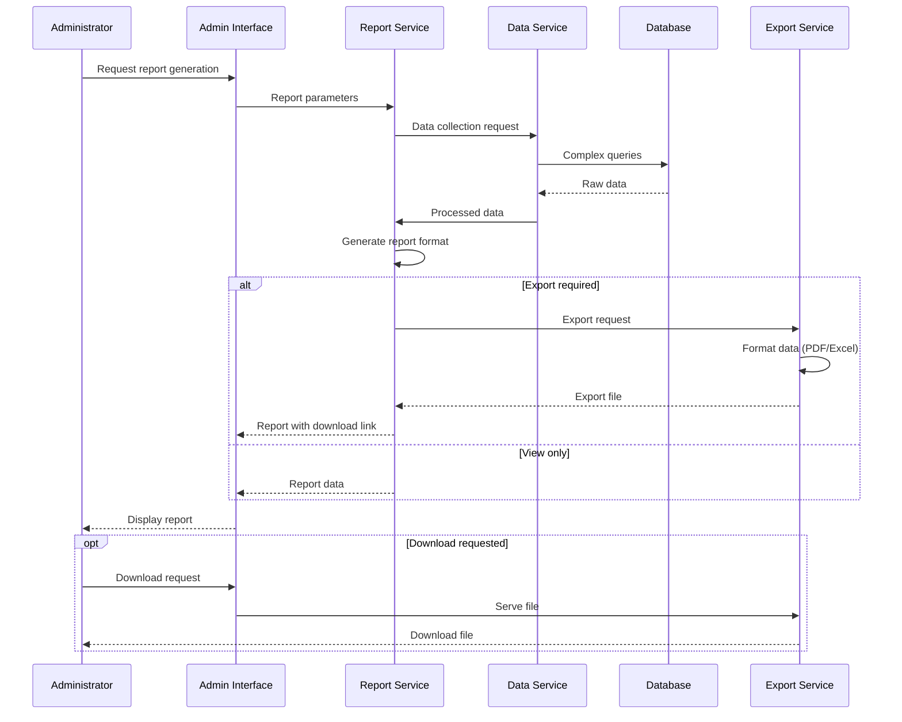

## 4. System Architecture Overview

### 4.1 High-Level System Components

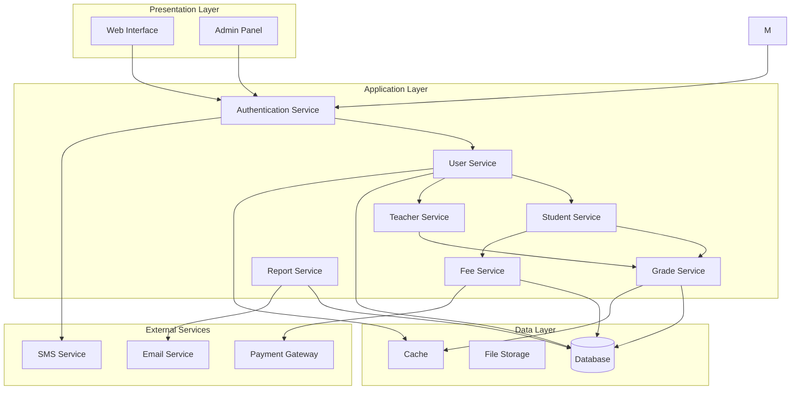

## 5. Key Features Summary

### Core Functionalities

- **User Management**: Student, Teacher, Parent, and Administrator profiles
- **Academic Management**:  subject management, timetable creation
- **Assessment System**: Assignment creation, grading, and report generation
- **Fee Management**: Fee calculation, payment processing, receipt generation
- **Communication**: Notifications, messaging between stakeholders
- **Reporting**: Comprehensive reports for academic and administrative purposes

### Security Features

- Role-based access control
- Secure authentication and authorization
- Data encryption and privacy protection
- Audit trails for all critical operations

### Integration Capabilities

- Payment gateway integration
- Email and SMS notification services
- Export capabilities (PDF, Excel)
- I did not cover non academic staffs in this flow