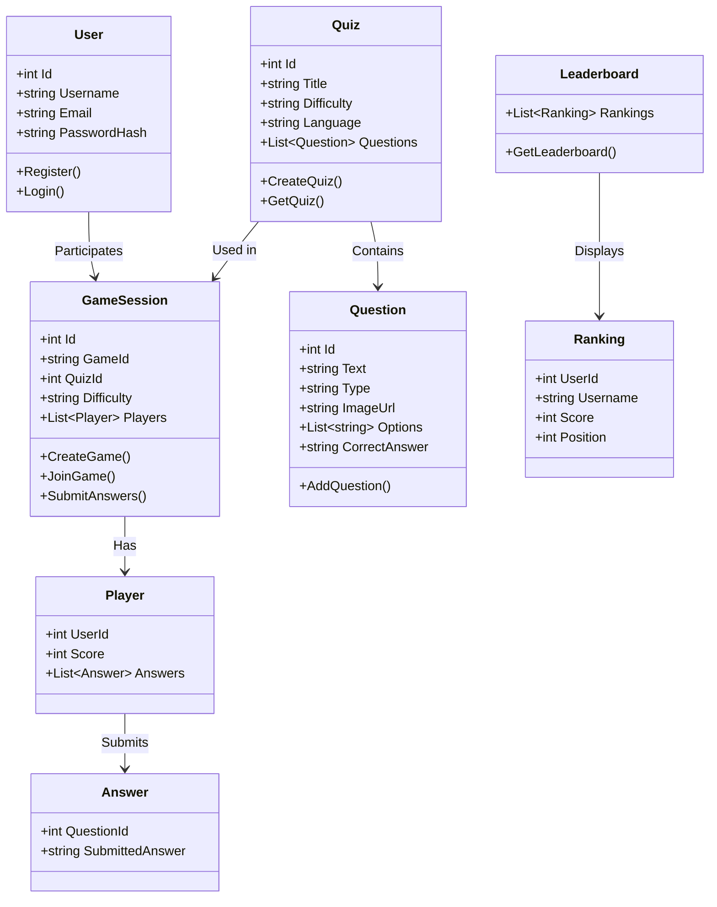
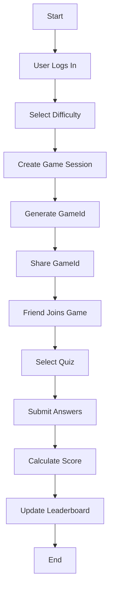

## Overview

SomethingSha is a quiz application with features for challenge level selection, quiz viewing, multiplayer game sessions, leaderboards, and question uploads. The tech stack includes HTML, CSS, JavaScript, C#, ASP.NET Web API, and PostgreSQL.

## API Endpoints

### Authentication

- **POST /api/auth/register**
    
    - Description: Register a new user.
        
    - Request Body:
        
        ```json
        {
          "username": "string",
          "email": "string",
          "password": "string"
        }
        ```
        
    - Response: 201 Created, user ID.
        
- **POST /api/auth/login**
    
    - Description: Authenticate a user.
        
    - Request Body:
        
        ```json
        {
          "email": "string",
          "password": "string"
        }
        ```
        
    - Response: 200 OK, JWT token.
        

### Quiz Management

- **GET /api/quizzes**
    
    - Description: Retrieve quizzes by difficulty or language.
        
    - Query Parameters:
        
        - difficulty: EASY, MEDIUM, HARD
            
        - language: e.g., German, English
            
    - Response: 200 OK, list of quizzes.
        
- **GET /api/quizzes/{id}**
    
    - Description: Get details of a specific quiz.
        
    - Response: 200 OK, quiz details including questions (MCQ, images).
        
- **POST /api/quizzes**
    
    - Description: Upload a new quiz (admin only).
        
    - Request Body:
        
        ```json
        {
          "title": "string",
          "difficulty": "EASY|MEDIUM|HARD",
          "language": "string",
          "questions": [
            {
              "text": "string",
              "type": "MCQ|TEXT",
              "imageUrl": "string",
              "options": ["string"],
              "correctAnswer": "string"
            }
          ]
        }
        ```
        
    - Response: 201 Created, quiz ID.
        

### Game Sessions

- **POST /api/games**
    
    - Description: Create a new game session and generate a GameId.
        
    - Request Body:
        
        ```json
        {
          "quizId": "int",
          "difficulty": "EASY|MEDIUM|HARD"
        }
        ```
        
    - Response: 201 Created, GameId.
        
- **POST /api/games/{gameId}/join**
    
    - Description: Join a game session using GameId.
        
    - Response: 200 OK, session details.
        
- **POST /api/games/{gameId}/submit**
    
    - Description: Submit answers for a game session.
        
    - Request Body:
        
        ```json
        {
          "answers": [
            {
              "questionId": "int",
              "answer": "string"
            }
          ]
        }
        ```
        
    - Response: 200 OK, score.
        

### Leaderboard

- **GET /api/leaderboard**
    
    - Description: Retrieve leaderboard rankings.
        
    - Query Parameters:
        
        - gameId: Optional, filter by game session.
            
    - Response: 200 OK, list of rankings.
        

### Dashboard

- **GET /api/dashboard/questions**
    
    - Description: View uploaded questions (admin only).
        
    - Response: 200 OK, list of questions.
        

## UML Class Diagram



## Activity Diagram (Create and Join Game Session)



## Database Schema (PostgreSQL)

```sql
CREATE TABLE Users (
    Id SERIAL PRIMARY KEY,
    Username VARCHAR(50) NOT NULL,
    Email VARCHAR(100) NOT NULL UNIQUE,
    PasswordHash VARCHAR(255) NOT NULL
);

CREATE TABLE Quizzes (
    Id SERIAL PRIMARY KEY,
    Title VARCHAR(100) NOT NULL,
    Difficulty VARCHAR(20) NOT NULL,
    Language VARCHAR(50) NOT NULL
);

CREATE TABLE Questions (
    Id SERIAL PRIMARY KEY,
    QuizId INT REFERENCES Quizzes(Id),
    Text TEXT NOT NULL,
    Type VARCHAR(20) NOT NULL,
    ImageUrl VARCHAR(255),
    Options JSONB,
    CorrectAnswer TEXT NOT NULL
);

CREATE TABLE GameSessions (
    Id SERIAL PRIMARY KEY,
    GameId VARCHAR(50) NOT NULL UNIQUE,
    QuizId INT REFERENCES Quizzes(Id),
    Difficulty VARCHAR(20) NOT NULL
);

CREATE TABLE Players (
    GameSessionId INT REFERENCES GameSessions(Id),
    UserId INT REFERENCES Users(Id),
    Score INT DEFAULT 0,
    PRIMARY KEY (GameSessionId, UserId)
);

CREATE TABLE Answers (
    Id SERIAL PRIMARY KEY,
    GameSessionId INT REFERENCES GameSessions(Id),
    UserId INT REFERENCES Users(Id),
    QuestionId INT REFERENCES Questions(Id),
    SubmittedAnswer TEXT NOT NULL
);
```