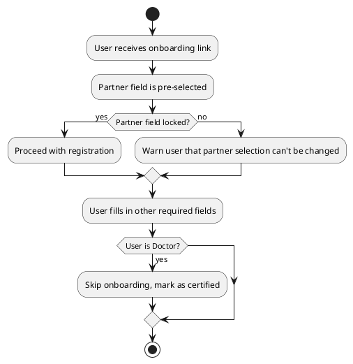
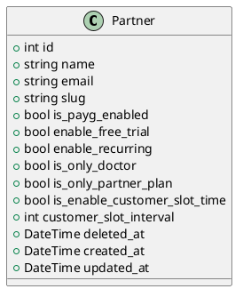

## Schema

| Field                          | Type       | Description                                                                                 |
| ------------------------------ | ---------- | ------------------------------------------------------------------------------------------- |
| `id`                           | `int`      | Unique identifier                                                                           |
| `name`                         | `string`   | Partner name                                                                                |
| `email`                        | `string`   | Partner email address                                                                       |
| `slug`                         | `string`   | Integration-friendly identifier (not exposing raw `id`)                                     |
| `is_payg_enabled`              | `boolean`  | Enables Pay-As-You-Go subscription model                                                    |
| `enable_free_trial`            | `boolean`  | If true, patients can access free trials (requires card for recurring billing via Paystack) |
| `enable_recurring`             | `boolean`  | Enables recurring billing                                                                   |
| `is_only_doctor`               | `boolean`  | Restricts patient visibility to partner's doctors only                                      |
| `is_only_partner_plan`         | `boolean`  | Restricts patient access to partner-created plans only                                      |
| `is_enable_customer_slot_time` | `boolean`  | Enables partner-specific time slot settings                                                 |
| `customer_slot_interval`       | `int`      | Time interval (in minutes) selected by the partner (e.g., 30, 40, 60)                       |
| `deleted_at`                   | `datetime` | Soft deletion timestamp                                                                     |
| `created_at`                   | `datetime` | Record creation timestamp                                                                   |
| `updated_at`                   | `datetime` | Last update timestamp                                                                       |

---

## Partner-specific Behavior

### Airtel

* Requires plan association before accessing free trial.
* Only certain plans qualify for free trial.
* Only card payments accepted.

### General

* Supports Excel document imports for onboarding (doctors/patients).
* Doctors imported are pre-certified; onboarding step skipped.
* Credentials are sent via email (preferred) or SMS.
* Processed in batch, not sequentially.

### Wellpart

* `is_only_doctor` is true.
* Custom partner plans enabled. is_only_partner_plan is true

### First Care

* Patients can only see plans created by this partner (`is_only_partner_plan` is true).
* Consultation flow is standard.

### WEMA

* Uses coupon codes for plan access.
* No direct interaction with the system.

### SUNO

* Not actively attached to the system.

### IHMS, SOJITEL, VOUCHER

* Communicate directly with the API.
* VOUCHER integration details pending (from Chisom).

---

## Activity Flow (UML)

---

## Class Diagram (UML)

---

## Notes for V3

* Ensure extensibility for partner-specific behavior.
* Introduce a strategy or policy pattern for differentiating partner flows.
* Use the `slug` for all external integrations and visibility checks.
* Enforce soft delete logic consistently.
* Optimize batch processing for onboarding to ensure concurrency safety and retry mechanisms.

---

## To-Do

* Finalize integration details for `VOUCHER` and `IHMS` from chisom.
* Determine if SUNO will participate in system-level flows.
* Consider building a partner settings dashboard for toggling flags dynamically.>)
* Currently there is no dashboard for this